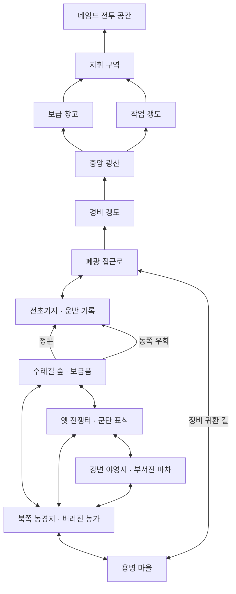

# 레벨 1 구현 안내

`GAME_DESIGN.md`의 「게임 시작부터 첫 네임드 처치·용사 등장까지의 구체 시나리오」를 기준으로 맵을 재구성했다. 경험치·드랍 전투는 유지하며, 장소와 동선의 구현 범위는 해당 문서의 「최신 요청에 따른 맵 적용 범위」를 따른다.

## 조작과 진행

1. 시작 화면에서 1(마법사) 또는 2(기사)를 선택한다.
2. 마을 게시판 근처에서 E로 안내를 읽고 **북쪽 길**을 따라 농경지로 나간다. WASD/방향키로 이동하고 Shift로 달린다.
3. 적을 바라보고 Ctrl을 반복해서 눌러 3단 공격을 한다. 적이 주황색으로 변하고 `!`가 나오면 공격 예고이므로 거리를 벌릴 수 있다.
4. 적 처치 즉시 경험치를 받는다. 노란 돈·파란 장비·빨간 회복 아이템은 접근하면 끌려온다.
5. I로 인벤토리를 열고 Page Up/Down으로 페이지를 넘긴다. 더 강한 장비는 자동 착용된다. 인벤토리를 열어도 전투는 계속된다.
6. 캐릭터 레벨 3과 돈·장비 습득을 달성하면 파밍 기초 완료 문구가 나온다. 전체 시나리오 완료를 의미하지 않는다. 농가를 조사하고 마을의 용병 NPC에게 돌아간 뒤 조사 지역과 폐광을 탐험할 수 있다.

**M**은 전체 지역 지도, **E**는 가까운 시설·단서의 설명이다. 지도·인벤토리를 열어도 게임 시간은 계속 흐르므로 필요하면 P로 일시정지한다. 상점·여관·게시판은 이번에는 위치와 안내만 제공하며 실제 거래·휴식·의뢰 시스템은 후속 범위다.

P는 일시정지, R은 마을 귀환이다. R은 성장과 드랍을 유지하고 HP를 회복시키지 않는다. 사망 시에는 성장·아이템 손실 없이 마을에서 회복한다. 프로그램을 종료하면 진행은 저장되지 않는다.

## 모듈 책임과 연결

| 파일·클래스 | 역할 |
|---|---|
| `LevelTypes.h` | 월드 좌표·오브젝트·드랍 종류와 주요 초기 밸런스 상수 |
| `TutorialLayout` | 시나리오의 13개 지역, 연결 길, 21개 시설·단서, 16개 적 배치 중심을 관리하는 공간 데이터와 조회 메서드 |
| `TutorialMapView` | 구역별 지면·다리·폐광 벽, 시설·단서 외형, M 키 지역 지도 |
| `LevelMap` | 레이아웃과 랜덤 장애물을 결합하고 지형·시설 충돌 및 직선 경로를 판정 |
| `BasicAttack` | Ctrl 연계의 상태·시간, 효과 시작 시점의 일회성 타격 이벤트 |
| `EnemySystem` | 적 생성·추격·공격 예고·피해·사망·재생성 |
| `PlayerProgression` | 경험치 누적, 남은 경험치 이월, 레벨업과 능력치·HP |
| `PlayerInventory` | 돈·장비 보관과 가장 강한 장비 하나의 자동 착용 |
| `LootSystem` | 확률 드랍, 초반 보장 보상, 자석 이동과 습득 |
| `LevelOneSession` | 타격→처치→경험치·드랍→습득을 연결하고 학습 목표·안내·사망 처리를 관리 |
| `LevelOneView` | 임시 적·드랍, HP·경험치·파밍 목표·인벤토리 표시 |
| `PrototypeWorld` | 기존 플레이어 이동·카메라·청크 표시와 위 시스템 연결, 발 위치에 따른 그리기 순서 |
| `SimpleGame` / `AttackInput` | 기존 키 입력·Ctrl 새 누름 감지와 업데이트 호출 |

매 프레임 공격 시간을 진행하고 `ConsumeHits()`로 타격을 한 번 소비한다. `LevelOneSession`은 사망한 적 위치만 받아 경험치를 지급하고 드랍을 만든다. 이동 후 적과 자석 습득을 갱신하고, 플레이어가 쓰러지면 위치만 마을로 되돌린 뒤 회복한다. 렌더링은 상태를 읽기만 하므로 화면 갱신 횟수가 보상 지급 횟수에 영향을 주지 않는다.

`std::array`는 직업별 3개 공격 클립, `std::vector`는 적·전리품·장비·타격 이벤트, `std::map`은 보이는 청크를 관리한다. `std::mt19937`와 표준 분포는 시드 기반 난수·드랍 확률에 사용한다. `enum class`로 돈·장비·회복을 구분하고, 기존 `std::stable_sort`에 적과 전리품을 합쳐 발 위치 기준으로 그린다. 모두 프로젝트의 v143 및 C++14 기본 모드에서도 지원하는 기능이며 특정 Debug 설정의 `stdcpplatest`에 의존하지 않는다.

## 갇힘을 방지하는 맵 구성

길은 시나리오 동선에 맞춘 선분들의 연결로 표현하고, 일반 도로 반폭은 48~80이다. 랜덤 장애물 중심은 길의 반폭에 충돌 반경 44를 더한 범위 밖에 둔다. 시설·단서와 전투 중심 주변도 따로 비운다. 절차적 장애물은 여전히 128 간격 셀에서 ±8만 이동하므로 서로 최소 112 떨어지며, 플레이어 크기를 포함한 반경 44의 금지 영역 사이에 최소 24의 여유가 남는다. 512 단위는 렌더링 청크 크기로만 사용한다.

강물에는 충돌이 있고 길과 교차하는 다리로 건넌다. 폐광 안에서는 방과 연결 통로만 걸을 수 있다. 다리·갱도 통행 영역은 플레이어 반경 11만큼 안쪽으로 잡는다. 입구·지휘문은 현재 열린 시각적 경계이며 잠금 조건은 없다. 적은 플레이어를 몸으로 막지 않는다. 실제 충돌과 지면·지역 이름·지도는 모두 `TutorialLayout`의 같은 데이터를 사용한다. 이 설명은 정적 구조 검토이며 실행으로 여러 시드를 탐색한 검증 결과가 아니다.

## 시나리오와 맵 대응

| 시나리오 | 배치 |
|---|---|
| 마을 도착·첫 의뢰 | 원점 마을의 게시판, 상점, 매입 상인, 여관, 용병 NPC |
| 첫 파밍·이상 징후 | 북쪽 농경지, 더 북쪽의 버려진 농가, 동쪽으로 향하는 수레 흔적 |
| 세 개의 독립 조사 | 서쪽 강변 마차, 북동쪽 수레길 숲 보급품, 북서쪽 옛 전쟁터 표식 |
| 군단 전초기지 | 숲 너머 북동쪽 야외 거점, 정문과 동쪽 우회로, 중앙 운반 기록 |
| 자발적 폐광 도전 전 준비 | 전초기지→폐광 접근로, 동쪽으로 크게 돌아 마을에 연결되는 귀환 길 |
| 폐광 공략 | 좁은 경비 갱도→중앙 광산→좌측 보급 창고/우측 작업 갱도→지휘 구역→전투 공간 |

방은 같은 월드 안에서 연결되는 공간 프로토타입이다. 별도 맵 로딩·의뢰 상태·문 개방·보스 및 용사 이벤트는 아직 없다. 모든 조사 장소는 선행 조건 없이 방문 가능하고, E 설명도 방문 순서와 관계없이 읽을 수 있다. 지역·길·랜드마크는 `std::vector`로 보관하고 `enum class`로 유형을 구분하며, 렌더러는 읽기 전용 조회를 통해 동일한 배치를 표시한다.

## 사용자 실행 확인 항목

빌드와 게임 실행은 수행하지 않았다. 아래 항목은 사용자가 확인할 시나리오다.

- 두 직업 각각 단타·2타·3타를 사용한다. 같은 타격에서 HP가 계속 깎이거나 같은 사망에서 보상이 반복 지급되지 않는지 확인한다.
- 장비 없이 첫 두 적을 처치하면 경험치 50으로 캐릭터 레벨 2가 되고, 이후 세 적을 더 처치하면 레벨 3이 되는지 확인한다. 최대 HP는 100→115→130으로 오른다.
- 첫 처치의 회복, 두 번째 처치의 장비, 매 처치의 돈이 보이는지 확인한다. 가까이 가면 자석 이동 후 사라지고 돈·장비·HP가 한 번만 반영되는지 확인한다.
- I에서 장비와 착용 표시를 확인하고 페이지 끝에서 Page Up/Down이 정상적으로 멈추는지 확인한다. 장비 보너스는 가장 강한 하나만 적용되어야 한다.
- 적의 예고 공격을 피하거나 맞아 HP 감소를 확인한다. HP 0에서 마을 복귀·회복과 성장 보존을 확인한다.
- P 및 다른 창으로 전환했을 때 적·공격·드랍 시간이 멈추는지 확인한다.
- M 지도에서 북쪽 농경지, 세 조사 지역, 전초기지 두 접근로, 폐광 분기·재합류를 확인한다. E로 게시판·농가·마차·보급품·표식·운반 기록을 읽는다.
- 마을 집 주변, 음수 좌표 및 청크 경계, 강 다리, 폐광 입구·코너·두 선택 경로를 이동한다. 재방문 시 동일한 장애물이 유지되고 시작 위치·필수 통로가 막히지 않는지 확인한다.
- R 귀환이 경험치·돈·장비를 지우거나 적 처치 보상을 다시 만들지 않는지 확인한다.

현재 적·시설·단서·드랍은 도형 기반 프로토타입 표현이다. 신규 스프라이트 제작, 수동 장비 교체·실제 상점 거래·스킬 선택·던전 전환/보스·저장 기능은 포함하지 않는다.
